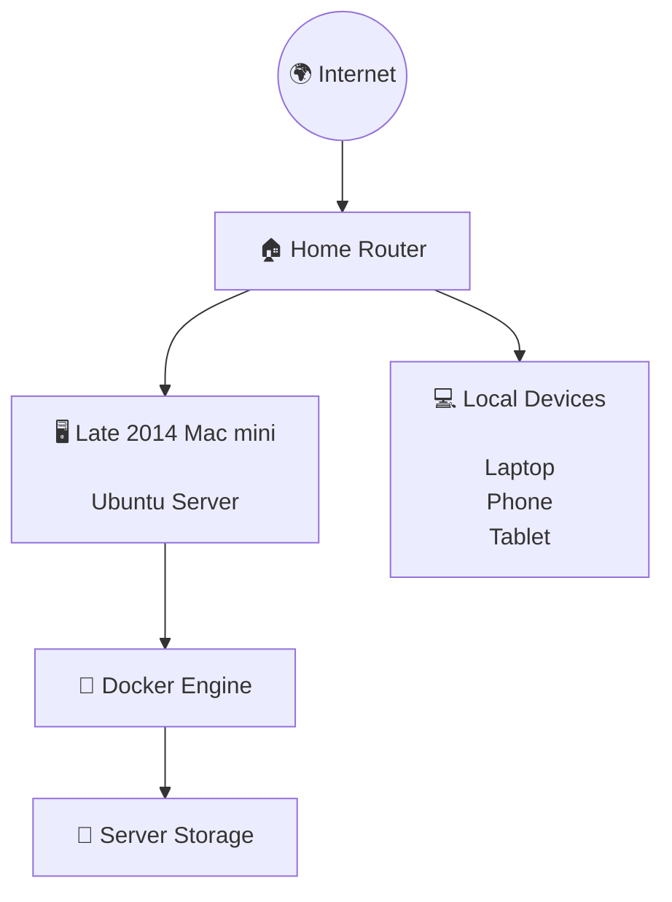
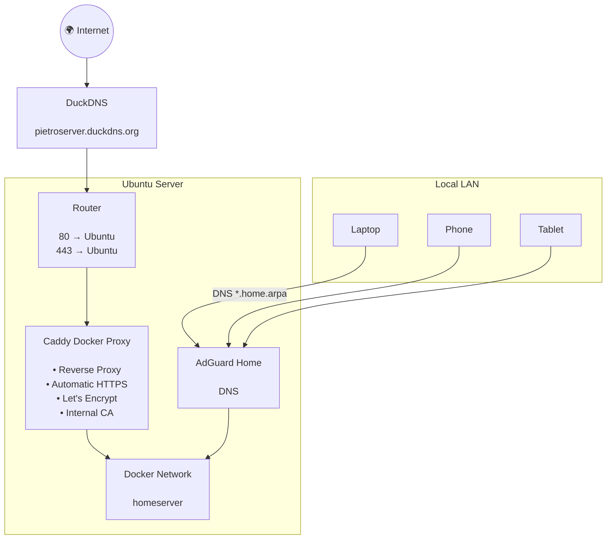
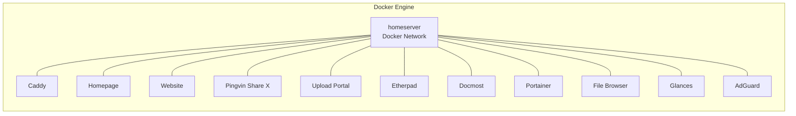
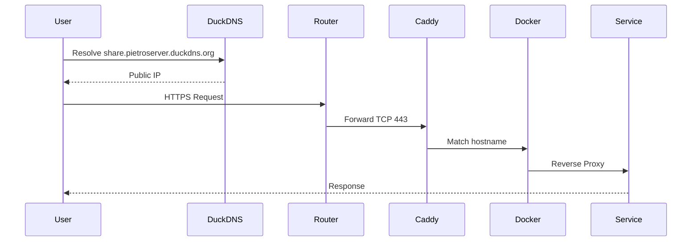
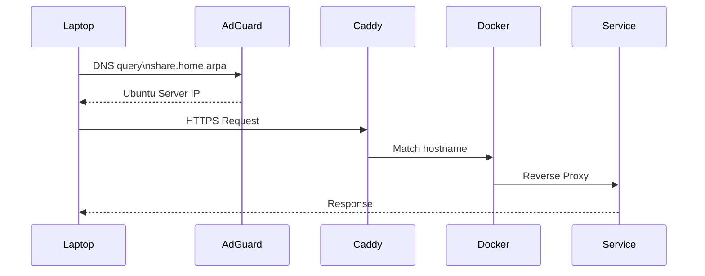
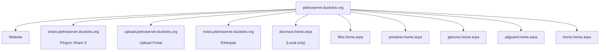

**Physical architecure**

```mermaid
flowchart TB

    Internet((🌍 Internet))

    Router["🏠 Home Router"]

    Mini["🖥️ Late 2014 Mac mini

Ubuntu Server"]

    Docker["🐳 Docker Engine"]

    SSD["💾 Server Storage"]

    Clients["💻 Local Devices

Laptop
Phone
Tablet"]

    Internet --> Router
    
    Router --> Mini

    Mini --> Docker

    Docker --> SSD

    Router --> Clients
```

**Network Architecure**

```mermaid
flowchart TB

    Internet((🌍 Internet))

    DuckDNS["DuckDNS

pietroserver.duckdns.org"]

    Router["Router

80 → Ubuntu
443 → Ubuntu"]

    Internet --> DuckDNS
    DuckDNS --> Router

    subgraph Ubuntu["Ubuntu Server"]

        Caddy["Caddy Docker Proxy

• Reverse Proxy
• Automatic HTTPS
• Let's Encrypt
• Internal CA"]

        AdGuard["AdGuard Home

DNS"]

        Network["Docker Network

homeserver"]

        Router --> Caddy

        Caddy --> Network

        AdGuard --> Network

    end

    subgraph LAN["Local LAN"]

        Laptop

        Phone

        Tablet

    end

    Laptop -->|"DNS *.home.arpa"| AdGuard
    Phone --> AdGuard
    Tablet --> AdGuard
```

**Docker Architecure**

```mermaid
flowchart LR

    subgraph Docker["Docker Engine"]

        Network["homeserver
Docker Network"]

        Caddy["Caddy"]

        Homepage["Homepage"]

        Website["Website"]

        Pingvin["Pingvin Share X"]

        Upload["Upload Portal"]

        Etherpad["Etherpad"]

        Docmost["Docmost"]

        Portainer["Portainer"]

        FileBrowser["File Browser"]

        Glances["Glances"]

        AdGuard["AdGuard"]

        Network --- Caddy

        Network --- Homepage

        Network --- Website

        Network --- Pingvin

        Network --- Upload

        Network --- Etherpad

        Network --- Docmost

        Network --- Portainer

        Network --- FileBrowser

        Network --- Glances

        Network --- AdGuard

    end
```

**Complete Request Flow**

```mermaid
sequenceDiagram

    participant User

    participant DuckDNS

    participant Router

    participant Caddy

    participant Docker

    participant Service

    User->>DuckDNS: Resolve share.pietroserver.duckdns.org

    DuckDNS-->>User: Public IP

    User->>Router: HTTPS Request

    Router->>Caddy: Forward TCP 443

    Caddy->>Docker: Match hostname

    Docker->>Service: Reverse Proxy

    Service-->>User: Response
```

**Local Request Flow**

```mermaid
sequenceDiagram

    participant Laptop

    participant AdGuard

    participant Caddy

    participant Docker

    participant Service

    Laptop->>AdGuard: DNS query\nshare.home.arpa

    AdGuard-->>Laptop: Ubuntu Server IP

    Laptop->>Caddy: HTTPS Request

    Caddy->>Docker: Match hostname

    Docker->>Service: Reverse Proxy

    Service-->>Laptop: Response
```

**Public Domain Map**

```mermaid
flowchart TB

    Root["pietroserver.duckdns.org"]

    Root --> Website["Website"]

    Root --> Share["share.pietroserver.duckdns.org

Pingvin Share X"]

    Root --> Upload["upload.pietroserver.duckdns.org

Upload Portal"]

    Root --> Notes["notes.pietroserver.duckdns.org

Etherpad"]

    Root --> Docs["docmost.home.arpa

(Local only)"]

    Root --> Files["files.home.arpa"]

    Root --> Portainer["portainer.home.arpa"]

    Root --> Glances["glances.home.arpa"]

    Root --> AdGuard["adguard.home.arpa"]

    Root --> Dashboard["home.home.arpa"]
```
